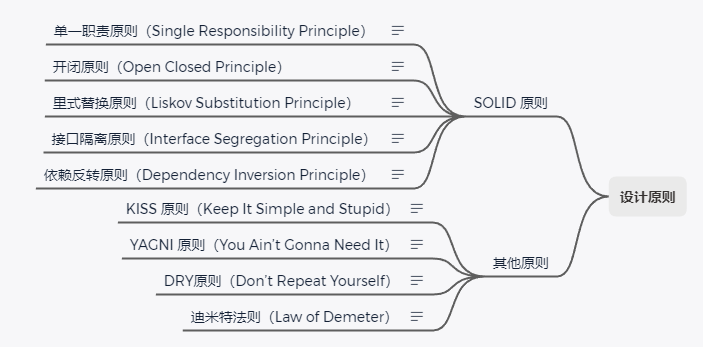

# 总结篇

## 设计原则

### 单一职责原则（Single Responsibility Principle）

一个类或者模块只负责`单一职责`。

### 开闭原则（Open Closed Principle）

软件实体（模块、类、方法等）应该`对扩展开放、对修改关闭`。

### 里式替换原则（Liskov Substitution Principle）

子类对象能够替换程序中父类对象出现的任何地方，并且保证原来程序的逻辑行为不变及正确性不被破坏。

另一种说法叫做：`按协议设计`。

### 接口隔离原则（Interface Segregation Principle）

客户端不应该被`强迫依赖`它不需要的接口。

### 依赖反转原则（Dependency Inversion Principle）

高层模块不要依赖低层模块。高层模块和低层模块应该通过抽象来互相依赖。

除此之外，`抽象不要依赖具体实现细节，具体实现细节依赖抽象`。

### KISS 原则（Keep It Simple and Stupid）

尽量`保持简单`。

### YAGNI 原则（You Ain’t Gonna Need It）

`不要做过度设计`。

### DRY原则（Don’t Repeat Yourself）

`不要重复自己`。

### 迪米特法则（Law of Demeter）

又叫`最少知识`原则（The Least Knowledge Principle），

每个模块只应该了解那些与它关系密切的模块的有限知识。

## 创建型

> 创建型模式主要解决对象的**创建**问题，**封装**复杂的创建过程，**解耦**对象的创建和使用，提升已有代码的灵活性和可复用性。
>
> 创建型模式包括：单例模式、工厂模式、建造者模式、原型模式。

---

### 单例模式

单例模式保证一个对象只能创建`一个实例`。

常见的实现方法有：饿汉式、懒汉式、双重检测、静态内部类、枚举等。

### 工厂模式

> 当创建逻辑比较复杂的时候，可以使用工厂模式把创建与使用进行解耦。

#### 简单工厂模式：

当每个对象的创建逻辑都比较简单的时候，可以使用简单工厂模式，将多个对象的`创建逻辑`放在一个工厂类中。

#### 工厂方法模式：

当每个对象的创逻建辑都比较复杂的时候，可以使用工厂方法模式，将每个对象的`创建逻辑`拆分到各自的工厂类中。

#### 抽象工厂模式：

当每个对象都有`一系列`相关或相互依赖的对象的时候，可以使用抽象工厂模式，相当于一组工厂方法的模式。

### 建造者模式

建造者（生成器）模式可以把`复杂的创建过程`拆分成多个步骤，允许使用不同的创建过程来创建不同的实例。

### 原型模式

如果对象的`创建成本`比较大，而不同实例直接相差不大时，可以使用原型模式来拷贝原有对象，节省创建成本。

## 结构型

> 结构型模式将对象和类**组装**成较大的结构，并保持结构的灵活和高效。这些经典的结构可以解决特定应用场景的问题。
>
> 结构型模式包括：代理模式、桥接模式、装饰器模式、适配器模式、门面模式、组合模式、享元模式。

### 代理模式

代理模式在不改变原始类接口的条件下为原始类定义一个代理类，提供`访问控制`功能与`附加功能`。

常见的实现方法有：静态代理、动态代理。

### 桥接模式

桥接模式将一个大类或者一系列紧密相关的类拆分为`抽象层次`和`实现层次`，开发时可以分别使用。

也可以理解为组合优于继承。

### 装饰器模式

装饰器模式通过组合来替代继承，给原始类提供`增强`功能，并且可以`嵌套`使用。

### 适配器模式

适配器模式将不兼容的接口转换为可`兼容`的接口，让原本由于接口不兼容而不能一起工作的类可以一起工作。

常见的实现方式有：类适配器（继承）、对象适配器（组合）。

### 门面模式

门面模式通过`封装细粒度接口`，为使用者提供简单的接口（也可用来解决性能、分布式事务等问题）。

### 组合模式

组合模式将一组对象组织成树形结构，将单个对象和组合对象都看作树中的节点，`统一逻辑处理`。

### 享元模式

享元模式在内存中`只保存一份实例`，复用对象节省资源。

与单例模式的差别在于：单例模式是类级别的，而享元是实例级别的。

## 行为型

> 行为模式负责对象间的高效**沟通**和职责**委派**。解决类或对象之间的交互问题。
>
> 结构型模式包括：观察者模式、模板模式、策略模式、职责链模式、迭代器模式、状态模式、访问者模式、备忘录模式、命令模式、解释器模式、中介模式。

### 观察者模式

观察者模式可以用来定义一种`订阅`机制，将观察者和被观察者代码解耦，可在对象事件发生时通知其他对象。

### 模板模式

模板方法可以让子类在不改变算法整体结构的情况下，重新`定义算法`中的某些步骤。

### 策略模式

策略模式定义一族算法类，将每个算法分别封装起来，让它们可以`互相替换`。

### 职责链模式

职责链模式将请求沿着处理者链进行`传递`，每个处理者均可对请求进行处理，或将其传递给下个处理者。

### 迭代器模式

迭代器模式也叫游标模式，在不暴露底层表现形式的同时，`遍历元素`。

### 状态模式

状态模式能在一个对象的内部状态变化时改变其行为（`状态机`）。

### 访问者模式

访问者模式将一个或者多个操作应用到一组对象上，解耦操作和对象本身。

主要目的在于：在单分派的语言中实现`双分派`的功能（Java是单分派的）。

### 备忘录模式

备忘录模式也叫`快照`模式，可以在不暴露对象实现细节（封装原则）的情况下保存和恢复对象之前的状态。

### 命令模式

它可以将请求转换为一个包含与请求相关的所有信息的独立对象。

转换让你能根据不同的请求`将方法参数化`，并且能够支持排队、延迟执行、记录日志、撤销等附加控制功能。

### 解释器模式

解释器模式为某个语言`定义语法表示`，并定义一个解释器用来处理这个语法。

### 中介模式

中介模式会限制对象之间的直接交互，迫使它们通过一个中介者对象进行合作，进行`中转与协调`。

## 总结

创建型模式解决`对象创建`问题，

结构型模式解决`类或对象的组合`问题，

行为型模式解决`类或对象之间的交互`问题。

实际上，设计模式要干的事情就是解耦：

创建型模式是将`创建和使用`代码解耦 ，

结构型模式是将`不同功能`代码解耦，

行为型模式是将`不同行为`代码解耦。

### 如何避免过度设计

- 设计的初衷是**提高代码质量**。
- 设计的过程是**先有问题**后有方案。
- 设计的应用场景是**复杂代码**。
- **持续重构**能有效避免过度设计。

### 如何避免设计不足

- 理论**知识储备**。
- 进行**刻意训练**。
- 要有**代码质量**意识、**设计**意识。
- 不要脱离具体的场景去谈设计。

### 最后

**设计原则和思想比设计模式更加普适和重要**。

掌握了代码的设计原则和思想，我们能更清楚的了解为什么要用某种设计模式，就能更恰到好处地应用设计模式。

同时遵循 KISS 原则，怎么简单怎么来，就是最好的设计。

