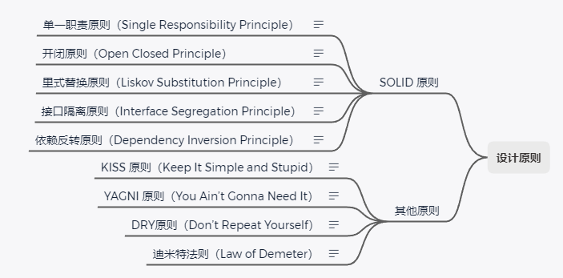

# 设计原则

## 单一职责原则（Single Responsibility Principle）

单一职责原则指：**一个类或者模块只负责完成一个职责**。

也就是说，不要设计大而全的类，要设计粒度小、功能单一的类。

同时也要根据场景去判断是否满足。

指导原则：
- 代码行数、函数、属性过多
- 依赖过多
- 私有方法过多
- 类命名困难
- 类中多数方法集中操作某几个属性

比如 UserInfo 的 address 相关字段，如果数据只做展示用，那么它的设计就是合理的。

但如果有其他功能模块使用到 address 相关字段，那就可以考虑抽取成一个 Address 类。

## 开闭原则（Open Closed Principle）

开闭原则指：软件实体（模块、类、方法等）应该“**对扩展开放、对修改关闭**”。

现有代码要更新功能，如果直接修改的话，会导致散弹式修改（比如修改了接口入参，那么接口代码、调用处、测试等地都需要修改）。

那么此时可以通过重构等手段，优化原有类的扩展性，从而实现在添加新功能时“对扩展开放、对修改关闭”。

指导原则：

为了尽量写出扩展性好的代码，我们要时刻具备扩展意识、抽象意识、封装意识。

最常用来提高代码扩展性的方法有：多态、依赖注入、基于接口而非实现编程，以及大部分的设计模式（装饰、策略、模板、职责链、状态等）。

很多设计原则、设计思想、设计模式，都是以提高代码的扩展性为最终目的的。

注意：不做过度设计，扩展性有时会跟可读性相冲突

## 里式替换原则（Liskov Substitution Principle）

里式替换原则指：**子类**对象能够**替换**程序中**父类**对象出现的任何地方，并且**保证**原来程序的**逻辑行为不变**及**正确性不被破坏**。

多态是一种特性，而里式替换是一种设计原则，多态看起来像是里式替换，但如果替换子类后会导致改变原有程序逻辑的，则不符合里式替换原则。

里式替换原则还有另外一个描述：**按协议设计**（子要遵守父的行为约定，包括输入、输出、异常以及父注释中的特殊说明）。

小窍门：用父类的单元测试去测子类的代码，如果运行失败则可能违背里式替换原则。

## 接口隔离原则（Interface Segregation Principle）

接口隔离原则指:**客户端不应该被强迫依赖它不需要的接口**。

这里的接口可以是指一组API集合、单个API接口或函数、面向对象中的接口概念。

一组API集合：如果部分接口只会被部分调用者使用，那么可以把这部分接口独立出来专门给调用者，而不强迫其他人使用这部分接口。

单个API接口或函数：接口或函数设计要单一、让调用者只依赖他所需要的那个细粒度功能。

面向对象中的接口：设计要单一，不要让实现者和调用者依赖不需要的接口。

小窍门：如果调用者只使用接口的部分功能，那么接口的设计就不单一。

## 依赖反转原则（Dependency Inversion Principle）

依赖反转（依赖倒置）原则指：高层模块不要依赖低层模块。高层模块和低层模块应该通过抽象来互相依赖。除此之外，抽象不要依赖具体实现细节，具体实现细节依赖抽象。

在平时的业务代码开发中，高层模块依赖底层模块是没有任何问题的，这条原则主要还是用来指导框架层面的设计。

例如 Tomcat 容器 与应用程序，Tomcat 容器 属于高层模块，应用程序属于低层模块，两者互不依赖，两者都依赖同一个对象：Servlet 规范。而 Servlet 规范也不依赖于 Tomcat 和应用程序。

## KISS 原则（Keep It Simple and Stupid）

**尽量保持简单**

KISS 原则是保证可读性与可维护性的重要手段。

方法建议：

- 少用同事可能不懂的技术实现（比如正则表达式）
- 不要重复造轮子
- 不要过度优化以及使用一些奇淫技巧

当然，如果本身就复杂的问题，用复杂的方法来解决，并不违背 KISS 原则。

小窍门：同事做 code review 时有很多疑问的话，那可能你的代码不够“简单”。

## YAGNI 原则（You Ain’t Gonna Need It）

**你不会需要它，不要做过度设计**。

意思是：不要去设计当前用不到的功能；不要去编写当前用不到的代码。

当然，这并不是说我们就不需要考虑代码的可扩展性，有必要的时候我们还是需要预留下扩展点，但是等到需要用到了再来实现编码。

## DRY 原则

**不要重复自己**（Don’t Repeat Yourself）

三种典型的代码重复：

- 实现逻辑重复
- 功能语义重复
- 代码执行重复

实现逻辑重复，但功能语义不重复的代码，并不违反 DRY 原则。

实现逻辑不重复，但功能语义重复的代码，也算违反 DRY 原则。

代码执行重复也算违反 DRY 原则。

提高代码可复用性方法：

- 减少代码耦合
- 满足单一职责原则
- 模块化
- 业务与非业务逻辑分离
- 通用代码下沉
- 继承、多态、抽象、封装
- 应用模板等设计模式

## 迪米特法则

**迪米特法则**（Law of Demeter），又叫**最少知识原则**（The Least Knowledge Principle）

每个模块只应该了解那些与它关系密切的模块的有限知识。或者说，每个模块只和朋友交流，不和陌生人交流。

不该有直接依赖关系的类之间，不要有依赖；有依赖关系的类之间，尽量只依赖必要的接口（也就是定义中的“有限知识”）、

“高内聚、松耦合” 是一个非常重要的设计思想，能够有效提高代码的可读性和可维护性，缩小功能改动导致的代码改动范围。“高内聚” 用来指导类本身的设计，“松耦合” 用来指导类与类之间依赖关系的设计。

